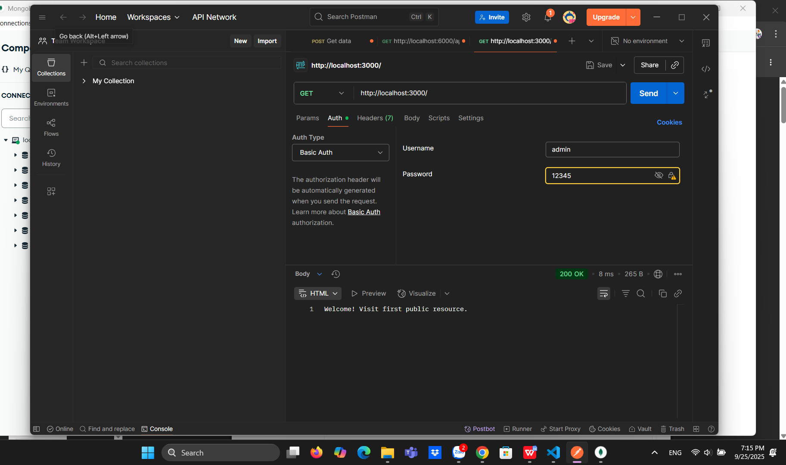

# 🔑 Simple Auth – Basic Authentication

## 📌 Mô tả
Dự án minh họa cơ chế Basic Authentication bằng Node.js.  
Khi gửi request phải kèm header `Authorization: Basic <credentials>`.

## 🚀 Cài đặt & chạy
```bash
npm install
node basic_auth.js
## Test PostMan:

