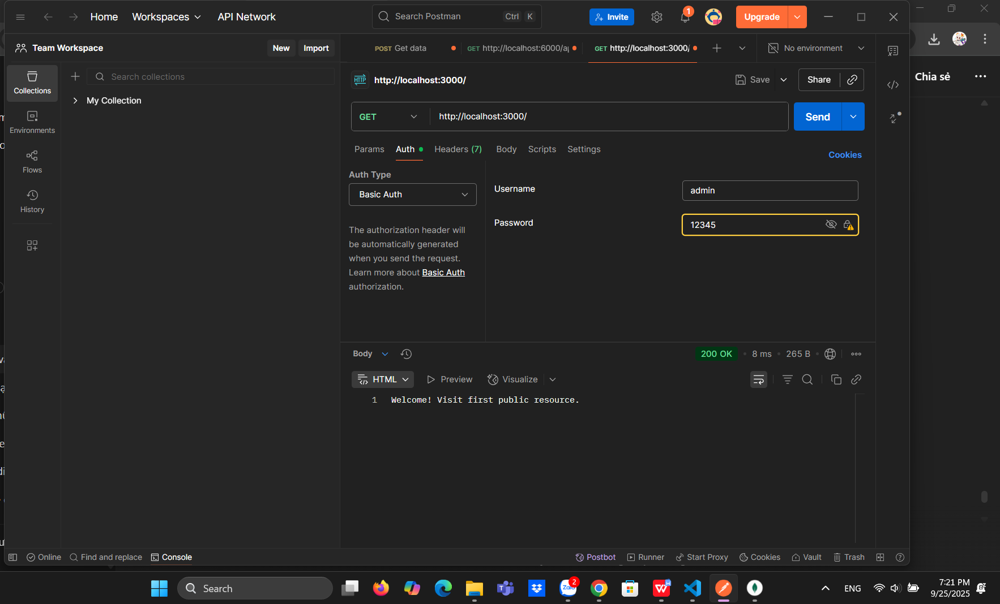

# Simple Auth – Basic Authentication

## Mo ta
Du an minh hoa co che Basic Authentication bang Node.js. Khi gui request phai kem header Authorization: Basic <credentials>.

## Cai dat va chay
Chay cac lenh sau trong terminal:
npm install
node basic_auth.js

Test Postman: URL: http://localhost:3000/ User: admin Pass: 12345

<<<<<<< HEAD

=======
>>>>>>> e9715c3 (Add validateDrug middleware and update routes)
